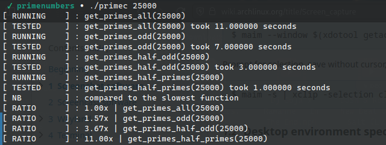
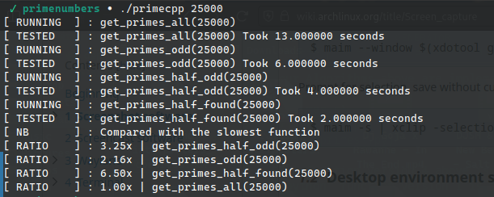
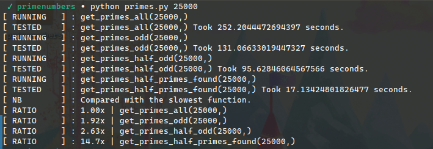

# PRIME NUMBER GENERATOR
**Hello Guys.**<small>[hello world]</small>

Generating Prime numbers using algorithms that are timed from the best perfoming to
the least one

There are for functions:
  1. **get_primes_all**
    To test a number n if it is prime, we devide it with all numbers before it
    but greater than 2
    
  2. **get_primes_odd**
    Same as above but we skip n if it is even except for 2 itself, hence doing less work
    which boosts the the program to take half the time the previou one took
    
  3. **get_primes_half_odd**
    All numbers that can be divided without a remainder, the divisor must be less than or
    equal to a half the dividend. Therefore, we can reduce the work the above function does
    by testing all the odds before a number n that are less than half of n, hence reducing 
    the time taken to generate q prime numbers.
    
  4. **get_primes_half_primes_found**
    Consider the number 63, if we were to test the number, we find that it will be divided by
    1, 3, 7, and 9. Mathematically, if a number a can be divided by b and c, and b can be divided
    by d and e, then a can be divided by b, c, d and e. therefore, a number is prime if all the
    prime numbers less than half of it, cannot divide the number without a remainder. This thus
    reduses the numbers we test hence reducing the time it takes to generate q prime numbers
  
The four Algorithms above are implemented in the languages:
- [C](primes.c)
- [C++](primes.cpp)
- [Python](primes\.py)

By Far c function version 4 above is the fastest while python  function version 1 is the slowest
The statistic will be uploaded soon.

## The Benchmarks
Note: This is a very poor benchmark, I have no Idea on how to benchmark software but I am trying my best.

The benchmarks are represented as terminal stats as they were run. In the future this will be some kind og GIF File or even better as **perf** output file.

The C++ and C performance vary where in one test, C is faster than C++ and inverse in others. The closeness may be judged as the same performance.

#### *C Performance*

#### *C++ Performance*

#### *Python Performance*

More python tests will be done on **cython** to see how fast pure **cython** is compared to importing **c/c++** libraries directly.

***Stay Tuned for the sequel: Cython vs C/C++ Imports***